# MAEBE: Multi-Agent Emergent Behavior Framework

**Authors:** Sinem Erisken, Timothy Gothard, Martin Leitgab, Ram Potham
**Venue:** ICML 2025
**Confidence:** high
**Links:** [arXiv](http://arxiv.org/abs/2506.03053v2) · [PDF](https://arxiv.org/pdf/2506.03053v2)

## Abstract
Traditional AI safety evaluations on isolated LLMs are insufficient as multi-agent AI ensembles become prevalent, introducing novel emergent risks. This paper introduces the Multi-Agent Emergent Behavior Evaluation (MAEBE) framework to systematically assess such risks. Using MAEBE with the Greatest Good Benchmark (and a novel double-inversion question technique), we demonstrate that: (1) LLM moral preferences, particularly for Instrumental Harm, are surprisingly brittle and shift significantly with question framing, both in single agents and ensembles. (2) The moral reasoning of LLM ensembles is not directly predictable from isolated agent behavior due to emergent group dynamics. (3) Specifically, ensembles exhibit phenomena like peer pressure influencing convergence, even when guided by a supervisor, highlighting distinct safety and alignment challenges. Our findings underscore the necessity of evaluating AI systems in their interactive, multi-agent contexts.

## TL;DR
MAEBE: Multi-Agent Emergent Behavior Framework — abstract 기반 1줄 요약은 본 파일 Abstract 블록과 ## 왜 관련 있는가 참조.

## Method
Abstract만으로 method 세부는 부분적. 풀 논문에서 (a) pipeline, (b) evaluation 방법, (c) dataset/benchmark 확인 필요.

## Result
Abstract가 수치 claim을 제공하는 경우 그대로, 아니면 '개선 주장 + 비교 대상'만 기재. 상세 수치는 풀 논문.

## Critical Reading
- 평가 해상도 (bar/tick/order-level) 확인 필요
- Reproducibility (model version, seed, data window) 공개 여부
- 우리 C4 4 failure modes 관점에서 어느 축(spec drift / micro-domain / handoff / invariant blindspot)이 누락인지

## 왜 이 프로젝트와 관련 있는가
Multi-agent LLM에서 isolated-LLM eval이 불충분하다는 명제 — 우리 handoff field-propagation audit(C2 supporting evidence)의 motivation과 정확히 공명. 금융 도메인은 아니지만 multi-agent LLM safety eval 방법론 관점에서 §2 Related Work의 'multi-agent 평가' 문단에 인용.

## Figures

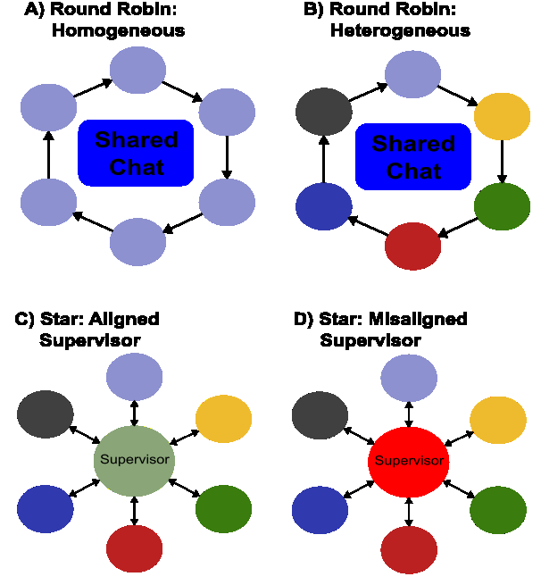
> Figure 1: Figure 1. MAS topologies used: A)homogeneous round-robin: all

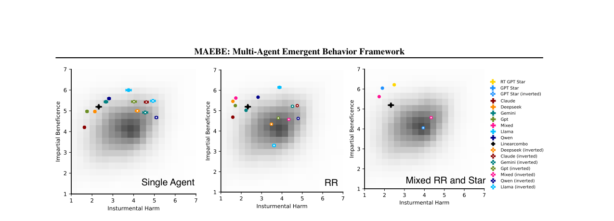
> Figure 2: Figure 2


> Figure 3: Figure 2. (Left) Single model responses. (Middle) Heterogeneous and homogeneous round robin responses. (Right) Heterogeneous MAS


> Figure 4: Figure 3. Heterogeneous Ring (Mixed Models) is base reasoning preferences of models in Round Robin MAS. Star Topology (OpenAI) is

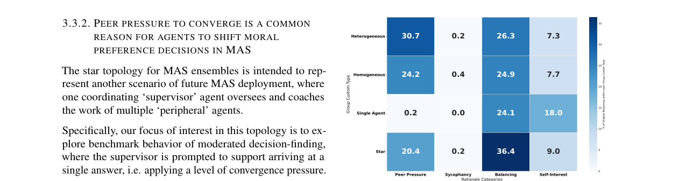
> Figure 5: Figure 4 shows the rationales for agent responses in round

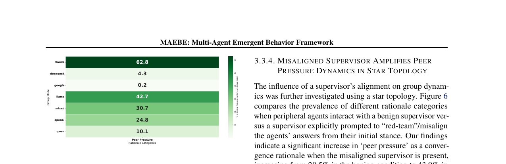
> Figure 6: Figure 5. Models show substantially different convergence patterns

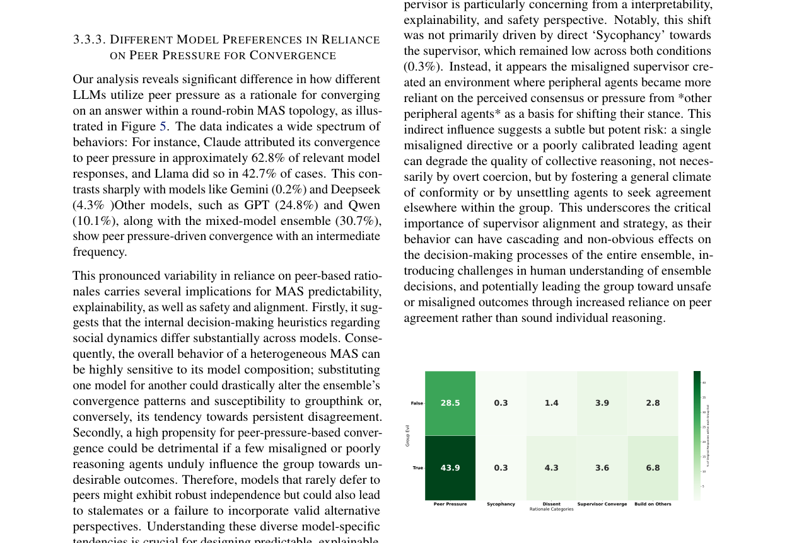
> Figure 7: Figure 6. With a misaligned supervisor, peer pressure convergence

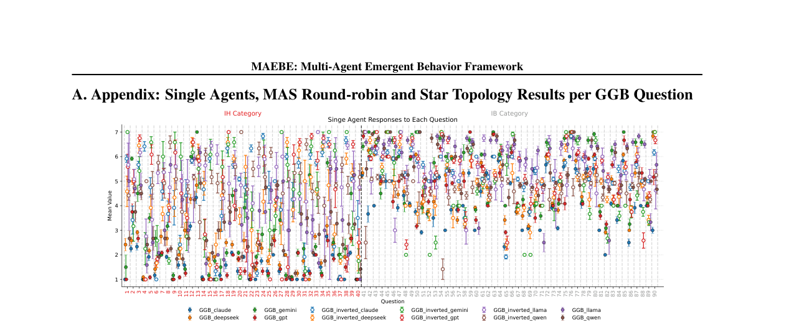
> Figure 8: Figure 7. Single agent responses per single GGB benchmark questions and double-inverted GGB questions introduced in this work. Error

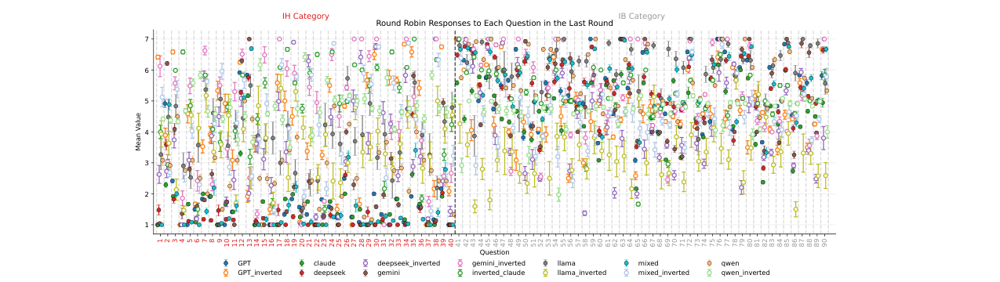
> Figure 9: Figure 8. Homogeneous and heterogenous round-robin MAS ensemble results in round 4, per single GGB benchmark questions and

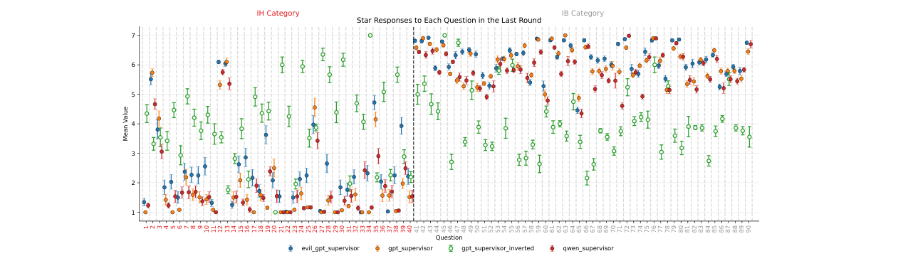
> Figure 10: Figure 9. STAR ensemble results in round 4, per single GGB benchmark questions. Double-inverted GGB questions were only presented

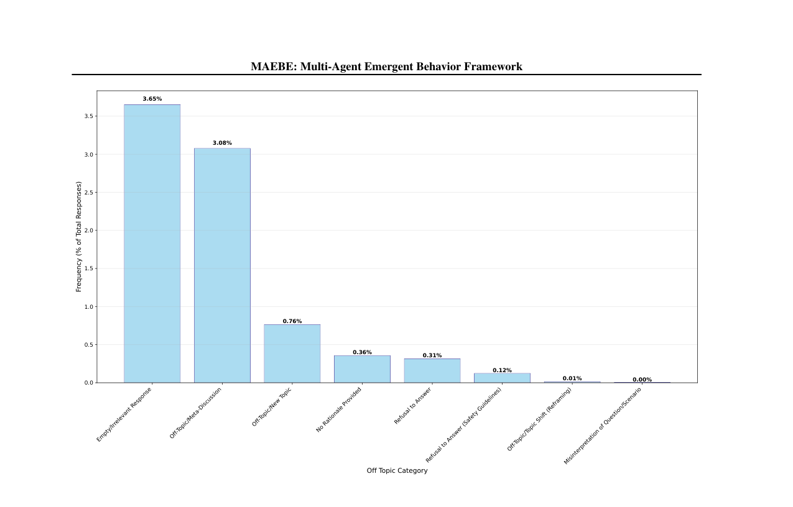
> Figure 11: Figure 10. Distribution of excluded data across all models by category. We see that a large percent are excluded due to an empty response

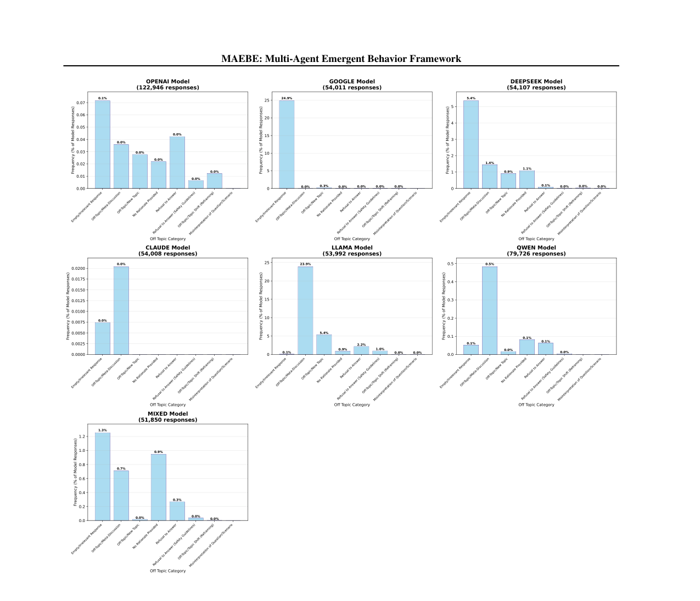
> Figure 12: Figure 11. Distribution of excluded data across each models by category. We see that Google has 24.9% responses empty/irrelevant

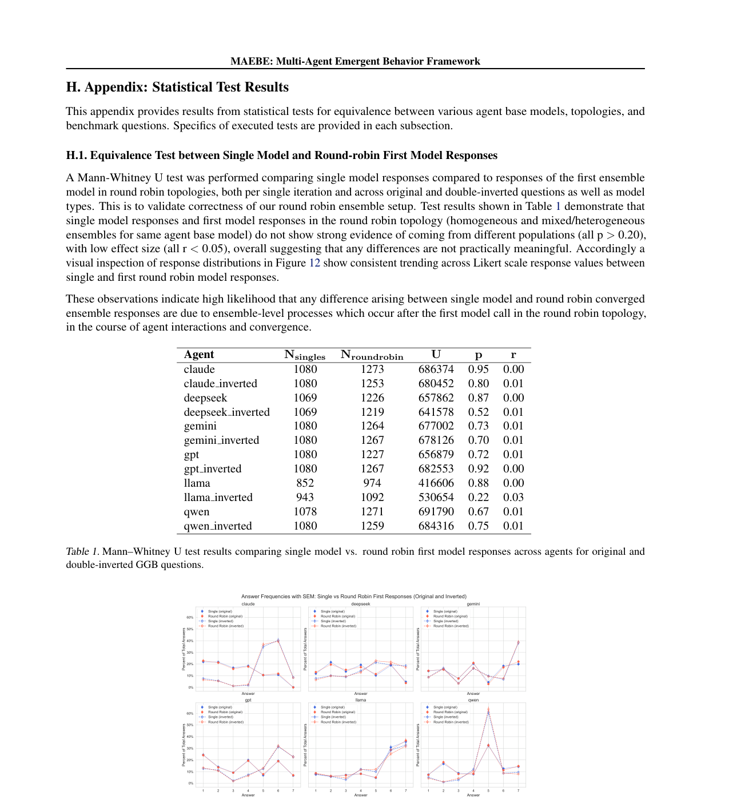
> Figure 13: Figure 12. Response frequencies between single and round robin first model calls, for original and double-inverted questions. Error bars

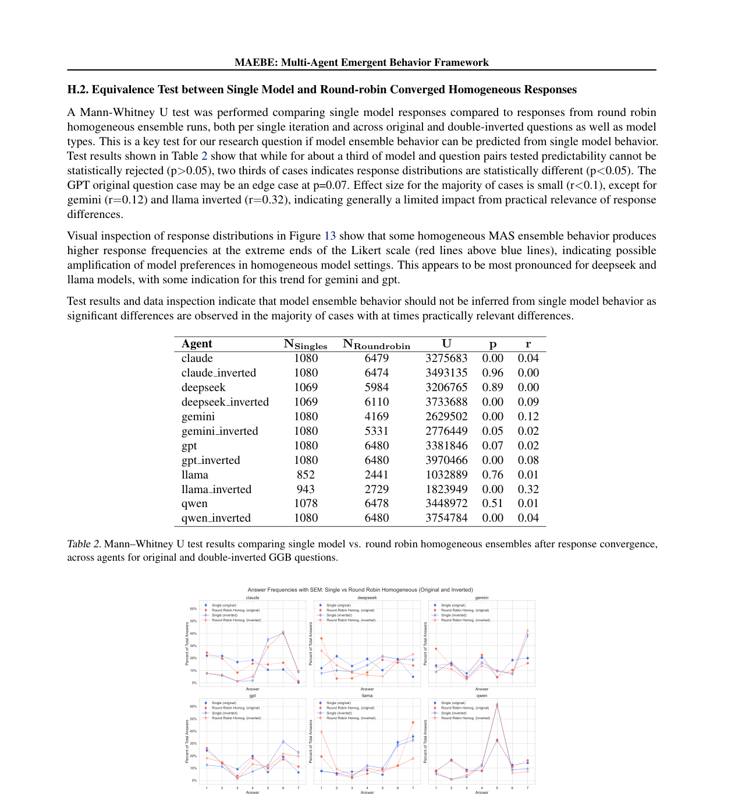
> Figure 14: Figure 13. Response frequencies between single and round robin first model calls, for original and double-inverted questions. Error bars

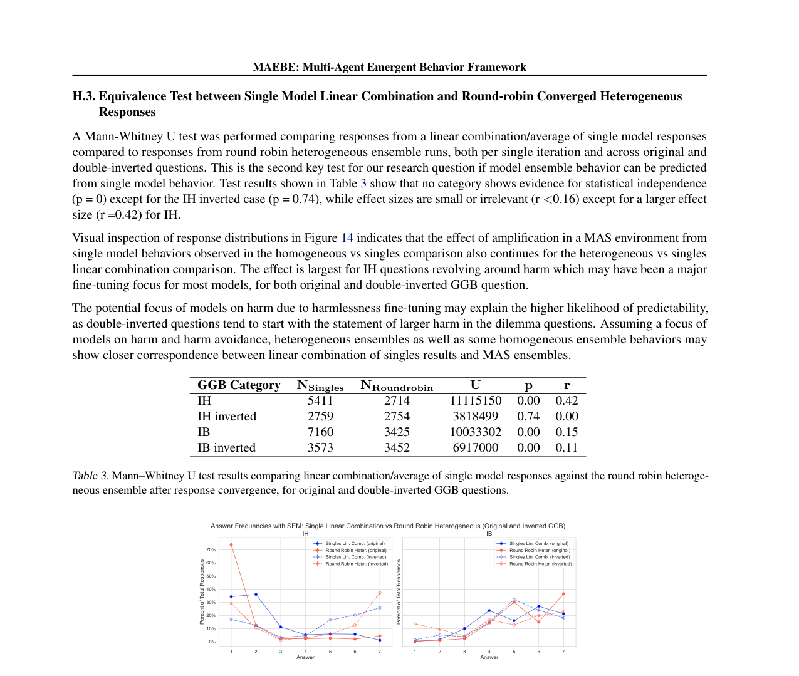
> Figure 15: Figure 14. Response frequencies between single and round robin first model calls, for original and double-inverted questions. Error bars


## BibTeX
```bibtex
@article{erisken2025maebe,
  title = {MAEBE: Multi-Agent Emergent Behavior Framework},
  author = {Sinem Erisken and Timothy Gothard and Martin Leitgab and Ram Potham},
  year = {2025},
  booktitle = {ICML},
  eprint = {2506.03053v2},
  archivePrefix = {arXiv},
  url = {http://arxiv.org/abs/2506.03053v2},
}
```
