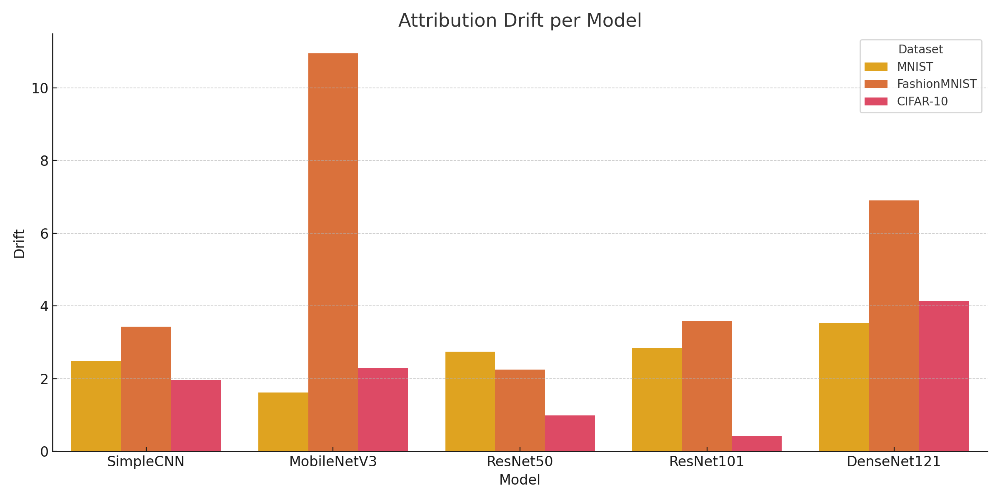
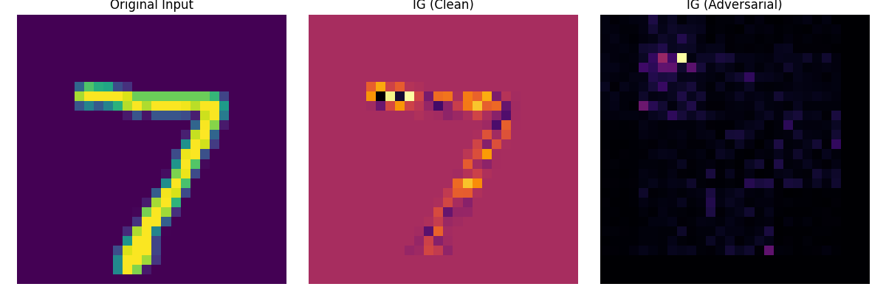
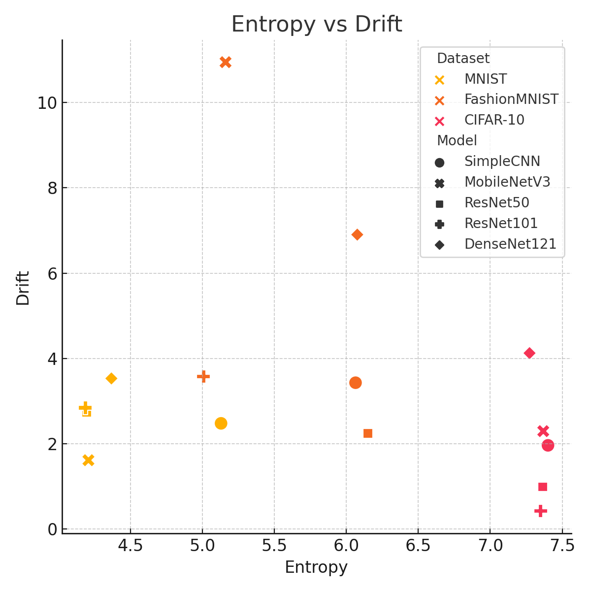
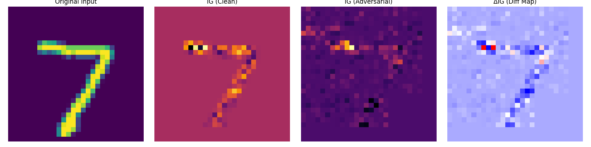
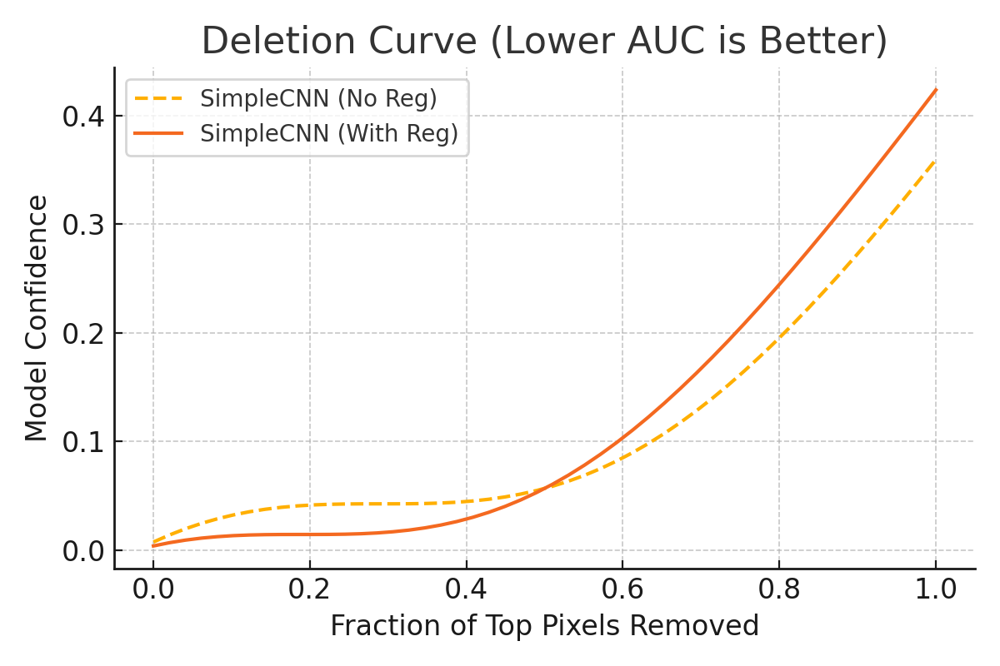

# TriGuard: Testing Model Safety with Attribution Entropy, Verification, and Drift

**Authors:** Dipesh Tharu Mahato, Rohan Poudel, Pramod Dhungana
**Venue:** ICML 2025
**Confidence:** high
**Links:** [arXiv](http://arxiv.org/abs/2506.14217v1) · [PDF](https://arxiv.org/pdf/2506.14217v1)

## Abstract
Deep neural networks often achieve high accuracy, but ensuring their reliability under adversarial and distributional shifts remains a pressing challenge. We propose TriGuard, a unified safety evaluation framework that combines (1) formal robustness verification, (2) attribution entropy to quantify saliency concentration, and (3) a novel Attribution Drift Score measuring explanation stability. TriGuard reveals critical mismatches between model accuracy and interpretability: verified models can still exhibit unstable reasoning, and attribution-based signals provide complementary safety insights beyond adversarial accuracy. Extensive experiments across three datasets and five architectures show how TriGuard uncovers subtle fragilities in neural reasoning. We further demonstrate that entropy-regularized training reduces explanation drift without sacrificing performance. TriGuard advances the frontier in robust, interpretable model evaluation.

## TL;DR
TriGuard: Testing Model Safety with Attribution Entropy, Verification, and Drift — abstract 기반 1줄 요약은 본 파일 Abstract 블록과 ## 왜 관련 있는가 참조.

## Method
Abstract만으로 method 세부는 부분적. 풀 논문에서 (a) pipeline, (b) evaluation 방법, (c) dataset/benchmark 확인 필요.

## Result
Abstract가 수치 claim을 제공하는 경우 그대로, 아니면 '개선 주장 + 비교 대상'만 기재. 상세 수치는 풀 논문.

## Critical Reading
- 평가 해상도 (bar/tick/order-level) 확인 필요
- Reproducibility (model version, seed, data window) 공개 여부
- 우리 C4 4 failure modes 관점에서 어느 축(spec drift / micro-domain / handoff / invariant blindspot)이 누락인지

## 왜 이 프로젝트와 관련 있는가
Formal robustness verification + attribution entropy + drift score — 우리 dual-mode counterfactual attribution과는 도메인이 다르나 'drift를 정량화하는 safety-eval framework'라는 포지션이 겹침. 차별점: 우리는 deterministic simulator + spec-invariant이므로 verification이 실제 backtest trace 위에서 동작.

## Figures


> Figure 1: Figure 1. Attribution entropy across all model–dataset com-


> Figure 2: Figure 1 presents attribution entropy across all models and


> Figure 3: Figure 2. Attribution drift across all models. FashionMNIST


> Figure 4: Figure 3. Integrated Gradients (IG) saliency on clean vs. adversarial inputs. Visual comparison for digit “7” shows that adversarial


> Figure 5: Figure 4. Correlation plots between attribution metrics and adversarial error. Left: entropy vs. drift shows a weak negative


> Figure 6: Figure 5. Contrastive attribution map using IG under adversarial perturbation. Red and blue regions visualize attribution displace-


> Figure 7: Figure 6. Faithfulness evaluation via Deletion/Insertion curves for SimpleCNN (with vs. without entropy regularization). Regularized


## BibTeX
```bibtex
@article{mahato2025triguard,
  title = {TriGuard: Testing Model Safety with Attribution Entropy, Verification, and Drift},
  author = {Dipesh Tharu Mahato and Rohan Poudel and Pramod Dhungana},
  year = {2025},
  booktitle = {ICML},
  eprint = {2506.14217v1},
  archivePrefix = {arXiv},
  url = {http://arxiv.org/abs/2506.14217v1},
}
```
