# Fincon: A synthesized llm multi-agent system with conceptual verbal reinforcement for enhanced financial decision making

**Authors:** Y Yu, Z Yao, H Li, Z Deng, Y Jiang
**Venue:** NeurIPS 2024
**Confidence:** high
**Links:** [arXiv](https://proceedings.neurips.cc/paper_files/paper/2024/hash/f7ae4fe91d96f50abc2211f09b6a7e49-Abstract-Conference.html) · [PDF](https://proceedings.neurips.cc/paper_files/paper/2024/file/f7ae4fe91d96f50abc2211f09b6a7e49-Paper-Conference.pdf)

## Abstract
We evaluate FINCON and benchmark it against other state-of-the-art LLM-based and  DRL-based agent systems using three key financial performance metrics: Cumulative Return (CR%

## TL;DR
Fincon: A synthesized llm multi-agent system with conceptual verbal reinforcement for enhanced financial decision making — abstract 기반 1줄 요약은 본 파일 Abstract 블록과 ## 왜 관련 있는가 참조.

## Method
Abstract만으로 method 세부는 부분적. 풀 논문에서 (a) pipeline, (b) evaluation 방법, (c) dataset/benchmark 확인 필요.

## Result
Abstract가 수치 claim을 제공하는 경우 그대로, 아니면 '개선 주장 + 비교 대상'만 기재. 상세 수치는 풀 논문.

## Critical Reading
- 평가 해상도 (bar/tick/order-level) 확인 필요
- Reproducibility (model version, seed, data window) 공개 여부
- 우리 C4 4 failure modes 관점에서 어느 축(spec drift / micro-domain / handoff / invariant blindspot)이 누락인지

## 왜 이 프로젝트와 관련 있는가
paper_outline.md §2에서 직접 baseline으로 명시한 핵심 관련작. FinCon은 multi-agent LLM financial system이지만 bar-level trading + conceptual verbal reinforcement가 중심 → tick-level LOB fidelity 이슈는 보이지 않음. 우리 C4(tick-level failure modes) 의 '기존 multi-agent 금융 LLM이 놓친 실패' 대표 사례로 positioning.

## Figures

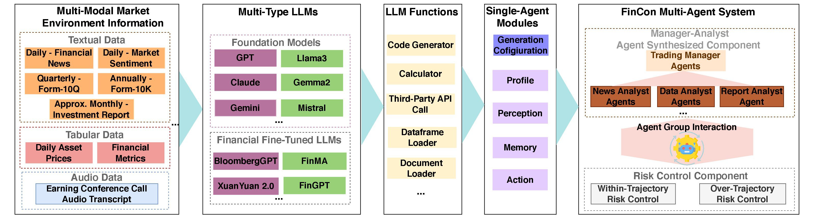
> Figure 1: Figure 1: The general framework of FINCON.

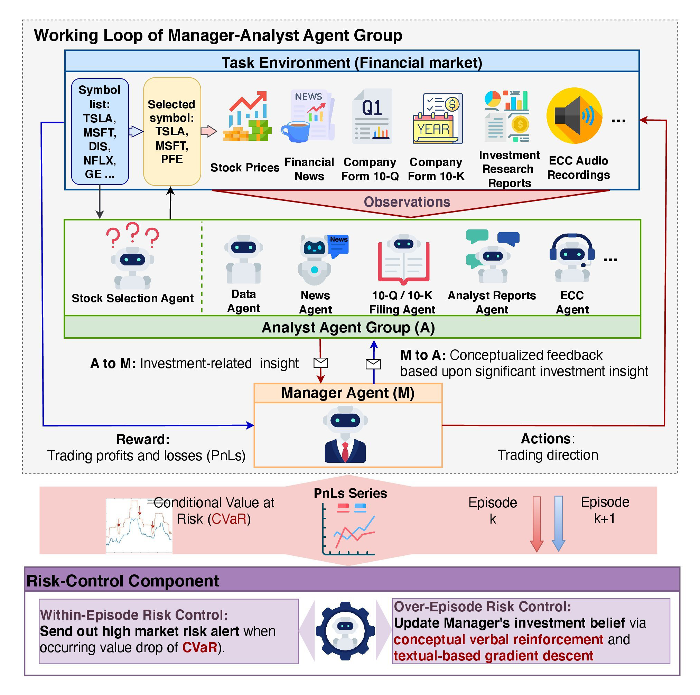
> Figure 2: Figure 2: The detailed architecture of FINCON contains two key components: Manager-Analyst

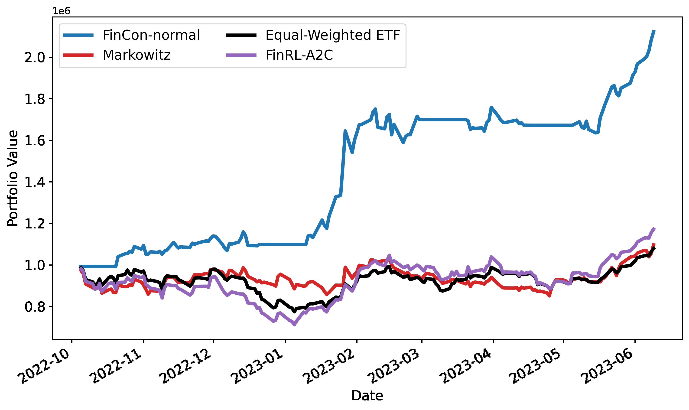
> Figure 3: Figure 3: Portfolio values of Portfolio 1 & 2 changes over time for all the strategies. The computation of

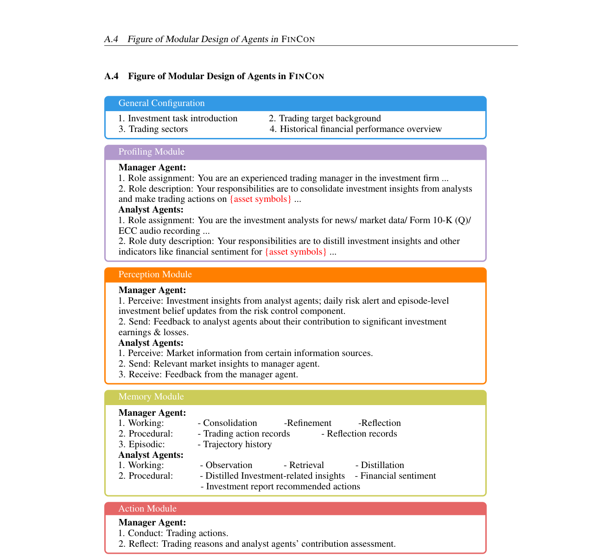
> Figure 4: Figure 4: The detailed modular design of the manager and analyst agents. The general configuration

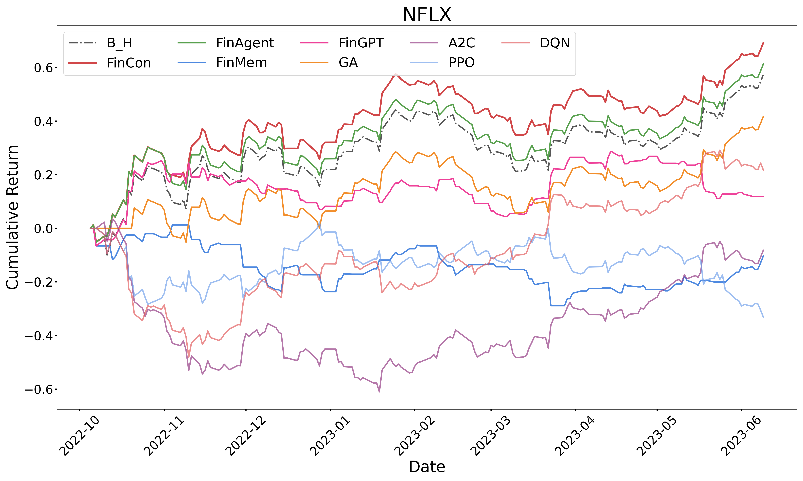
> Figure 5: Figure 5: CRs over time for single-asset trading tasks. FINCON outperformed other comparative strategies,

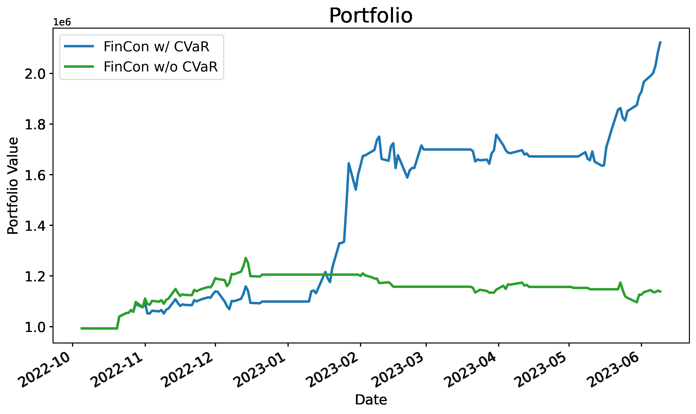
> Figure 6: Figure 6: CRs of FINCON with vs. without implementing CVaR for within-episode risk control show that

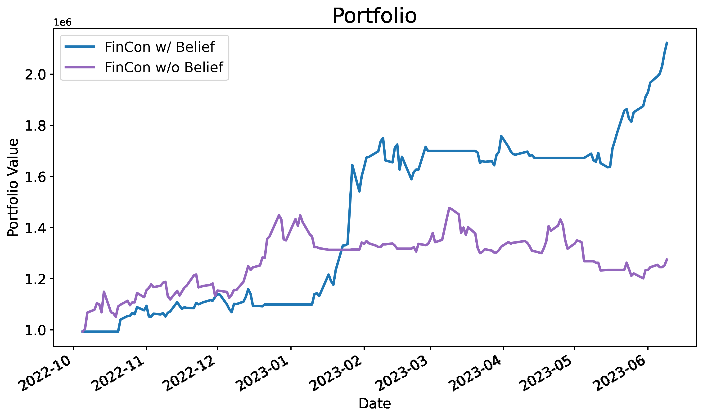
> Figure 7: Figure 7: CRs of FINCON with vs. without belief updates for over-episode risk control. (a) The CRs over

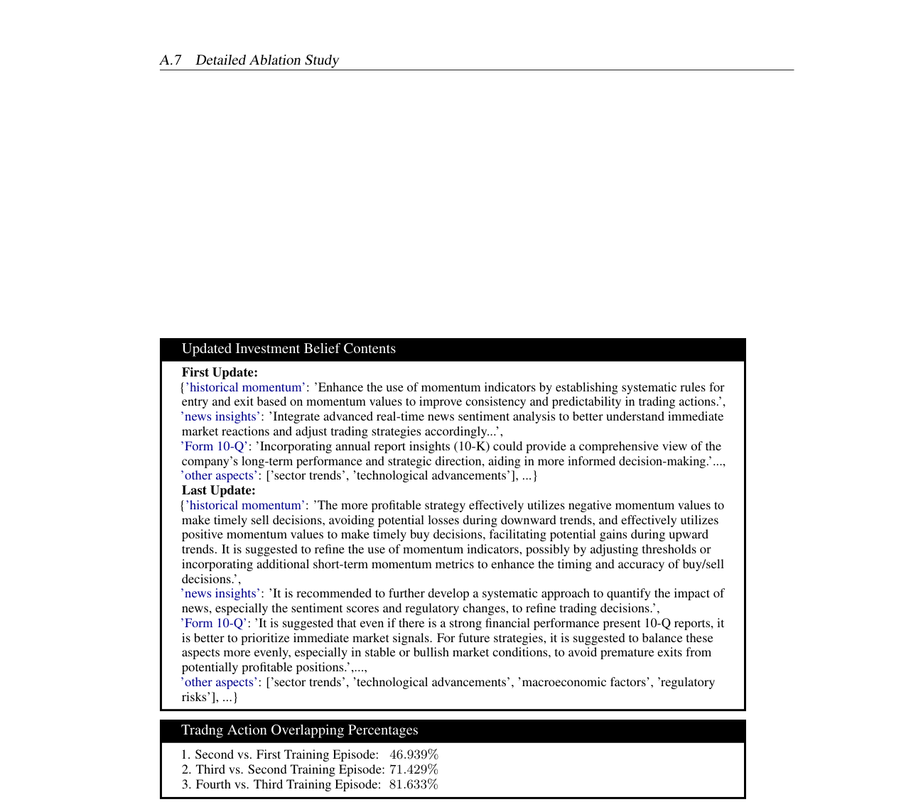
> Figure 8: Figure 8: The first time and last time LLM generated investment belief updates by CVRF for GOOG.

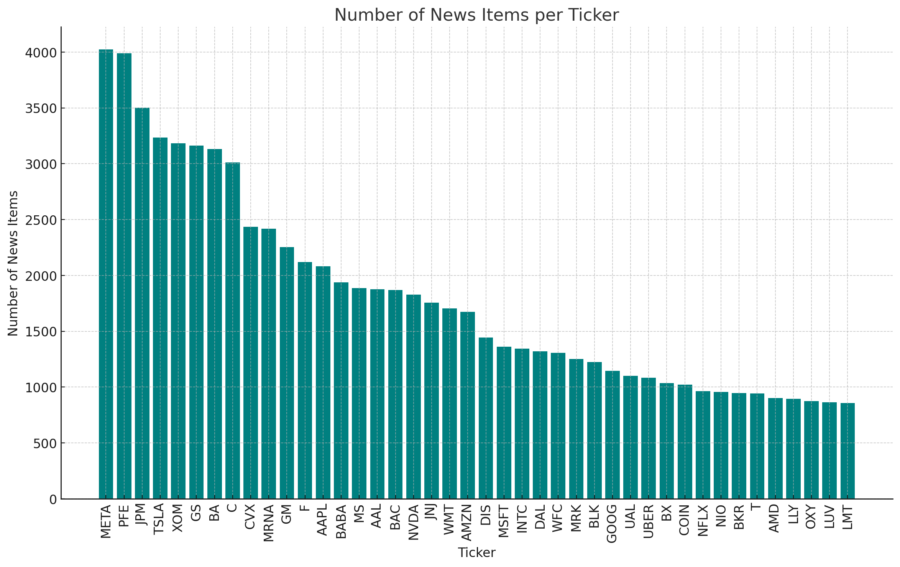
> Figure 9: Figure 9: The distribution of news from REFINITIV REAL-TIME NEWS for the 42 stocks in the

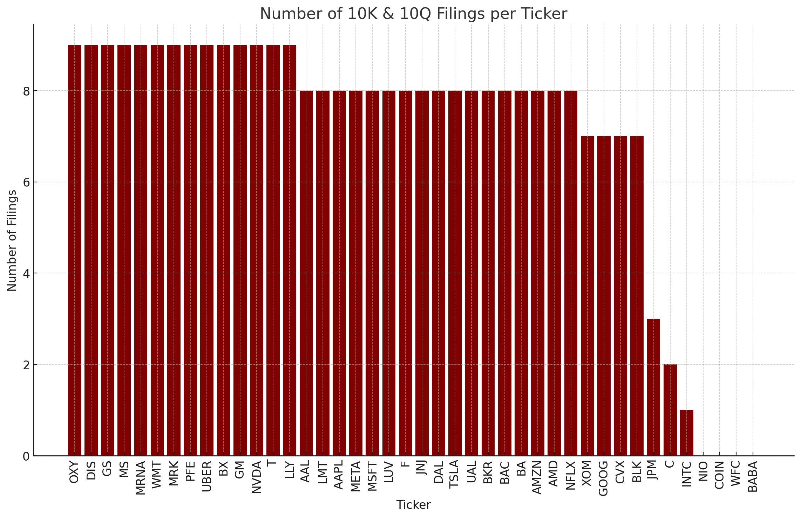
> Figure 10: Figure 10: The distribution of 10k10q from Securities and Exchange Commission (SEC) for the 42

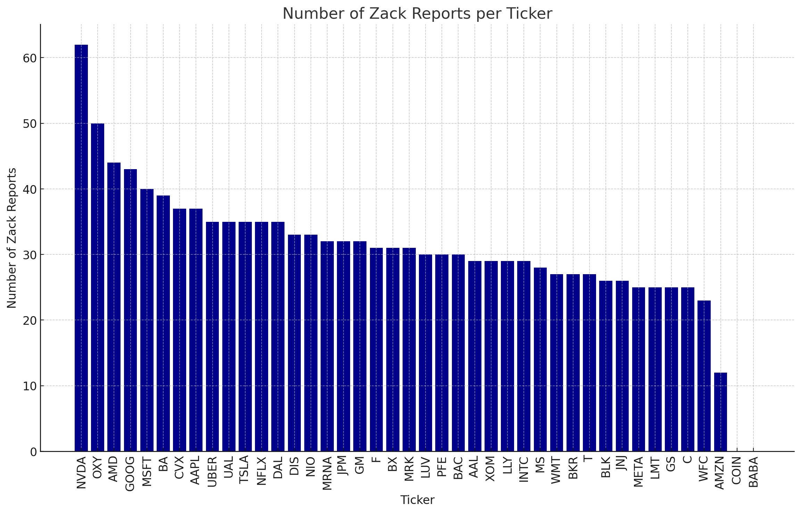
> Figure 11: Figure 11: The distribution of Analyst Report from Zacks Equity Research for the 42 stocks in the

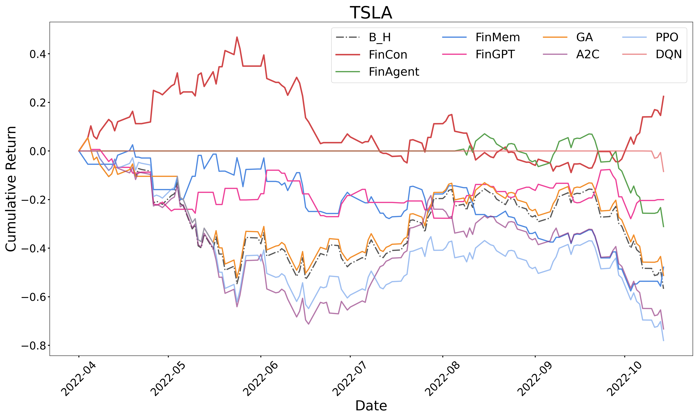
> Figure 12: Figure 12: CR changes over time across all the strategies

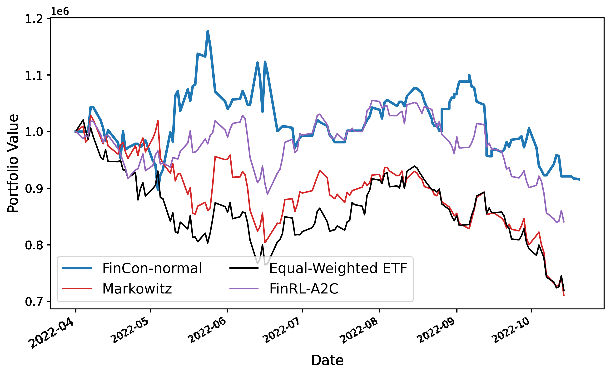
> Figure 13: Figure 13: Portfolio1 value changes over time for all the


## BibTeX
```bibtex
@inproceedings{yu2024fincon,
  title = {Fincon: A synthesized llm multi-agent system with conceptual verbal reinforcement for enhanced financial decision making},
  author = {Y Yu and Z Yao and H Li and Z Deng and Y Jiang},
  year = {2024},
  booktitle = {NeurIPS},
  url = {https://proceedings.neurips.cc/paper_files/paper/2024/hash/f7ae4fe91d96f50abc2211f09b6a7e49-Abstract-Conference.html},
}
```
