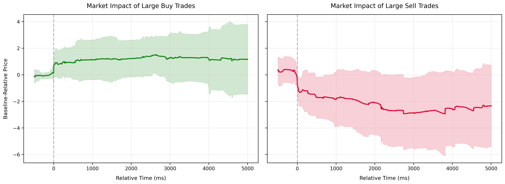
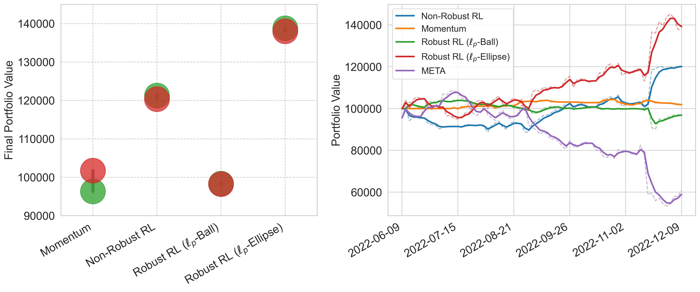
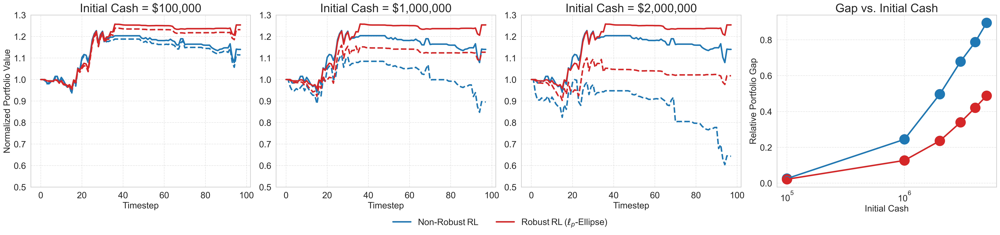
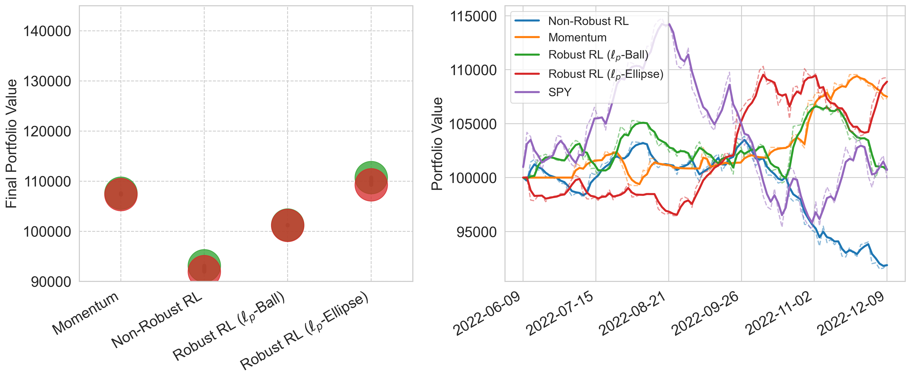

# Robust Reinforcement Learning in Finance: Modeling Market Impact with Elliptic Uncertainty Sets

**Authors:** S Ma, H Huang
**Venue:** NeurIPS 2025
**Confidence:** high
**Links:** [arXiv](https://arxiv.org/abs/2510.19950) · [PDF](https://arxiv.org/pdf/2510.19950)

## Abstract
captures more detailed market microstructure and reduces the  to incorporating market impact  into backtesting include agent- -agent reinforcement learning in a realistic limit order book

## TL;DR
Robust Reinforcement Learning in Finance: Modeling Market Impact with Elliptic Uncertainty Sets — abstract 기반 1줄 요약은 본 파일 Abstract 블록과 ## 왜 관련 있는가 참조.

## Method
Abstract만으로 method 세부는 부분적. 풀 논문에서 (a) pipeline, (b) evaluation 방법, (c) dataset/benchmark 확인 필요.

## Result
Abstract가 수치 claim을 제공하는 경우 그대로, 아니면 '개선 주장 + 비교 대상'만 기재. 상세 수치는 풀 논문.

## Critical Reading
- 평가 해상도 (bar/tick/order-level) 확인 필요
- Reproducibility (model version, seed, data window) 공개 여부
- 우리 C4 4 failure modes 관점에서 어느 축(spec drift / micro-domain / handoff / invariant blindspot)이 누락인지

## 왜 이 프로젝트와 관련 있는가
Market impact를 elliptic uncertainty set으로 robust RL에 통합 — agent-based RL in realistic LOB로 확장. 우리 engine의 market-impact 모델링 (queue-position fills + 5ms latency)은 이 논문의 가정과 대조할 가치가 있고, §3.6 engine-agnostic 주장 시 'LOB + RL backtest' 축에서 참조.

## Figures


> Figure 1: Figure 1: Market impact illustration using AMZN stock on June 21, 2012, based on 5-level LOBSTER


> Figure 2: Figure 2: Illustration of the transition kernel in a simplified robust RL setting using an ℓ8-norm


> Figure 3: Figure 3: Performance comparison of trading strategies on the META stock from June 9 to December


> Figure 4: Figure 4: Robustness of RL agents to market impact under increasing trading volumes. The left three


> Figure 5: Figure 5: Performance comparison of trading strategies on the MSFT stock and SPY ETF.


## BibTeX
```bibtex
@inproceedings{ma2025robust,
  title = {Robust Reinforcement Learning in Finance: Modeling Market Impact with Elliptic Uncertainty Sets},
  author = {S Ma and H Huang},
  year = {2025},
  booktitle = {NeurIPS},
  url = {https://arxiv.org/abs/2510.19950},
}
```
