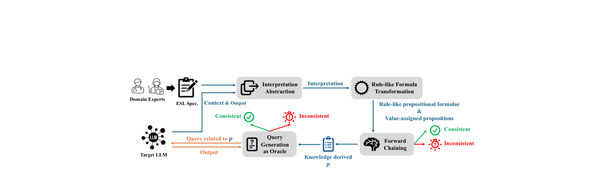
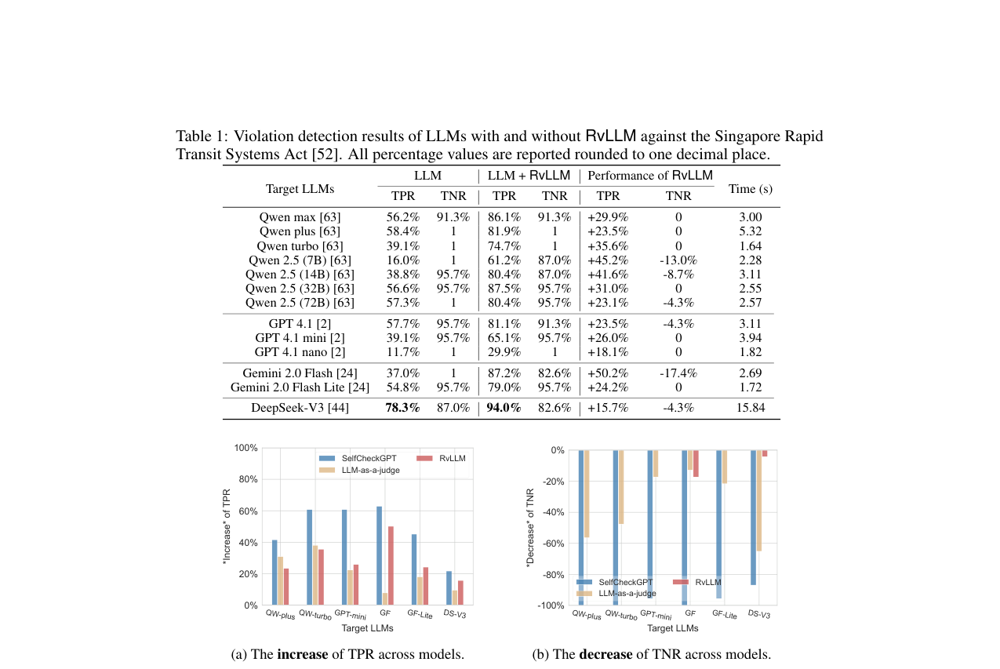
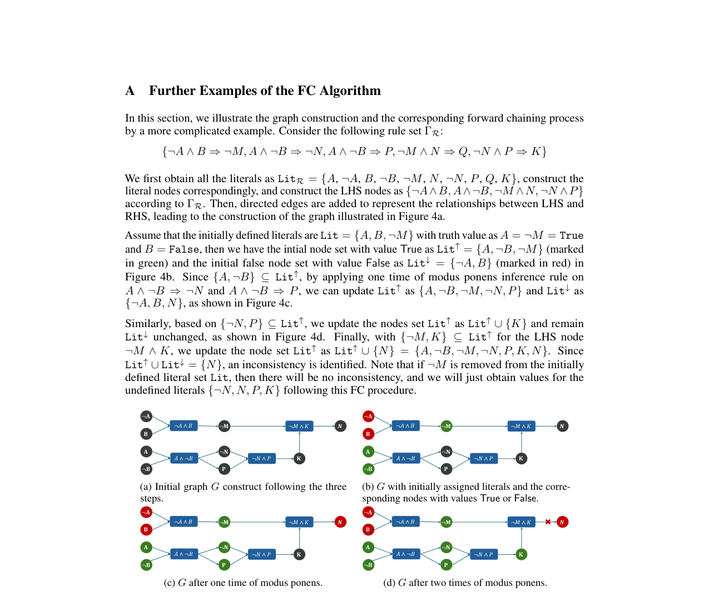
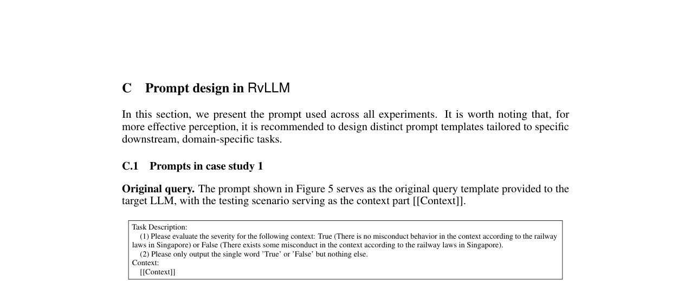
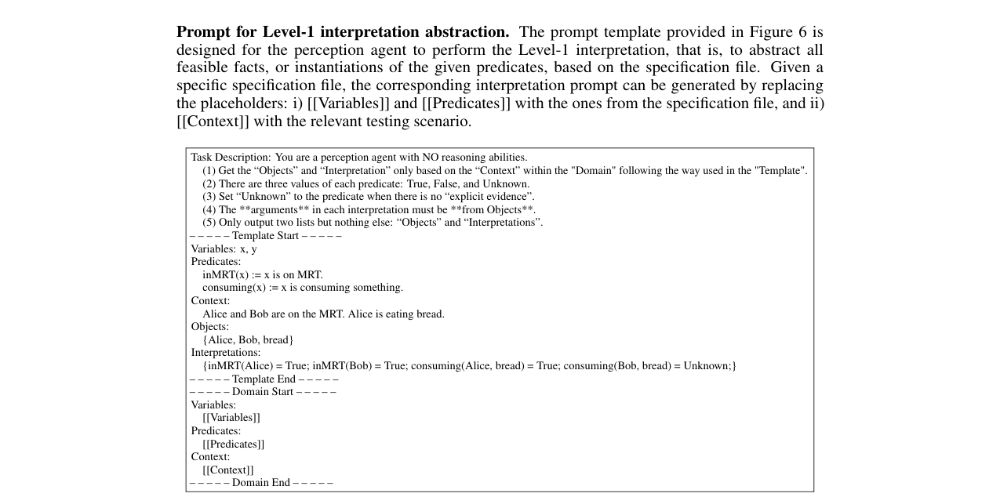
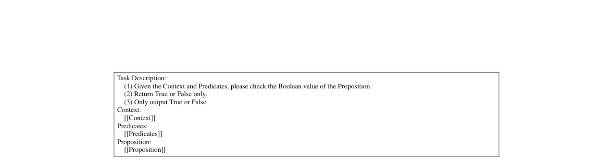
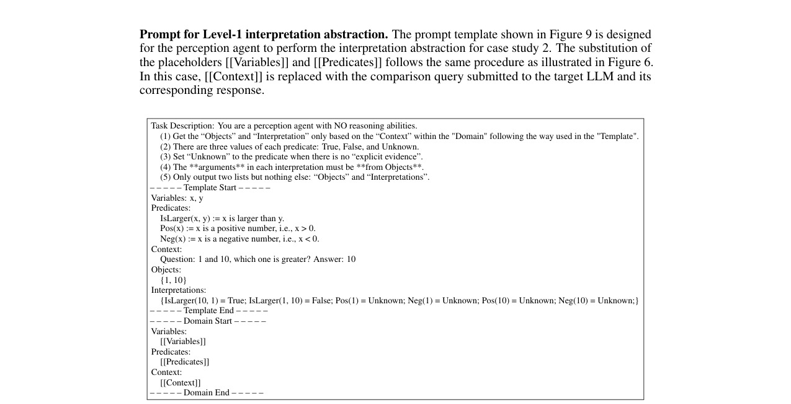
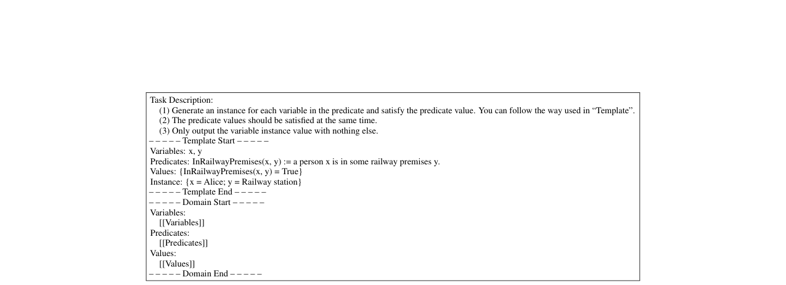
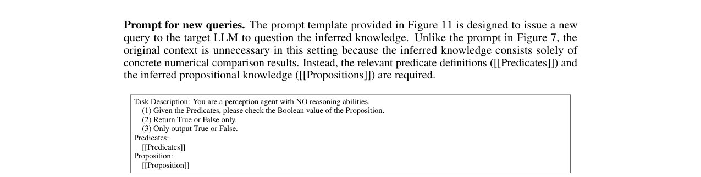
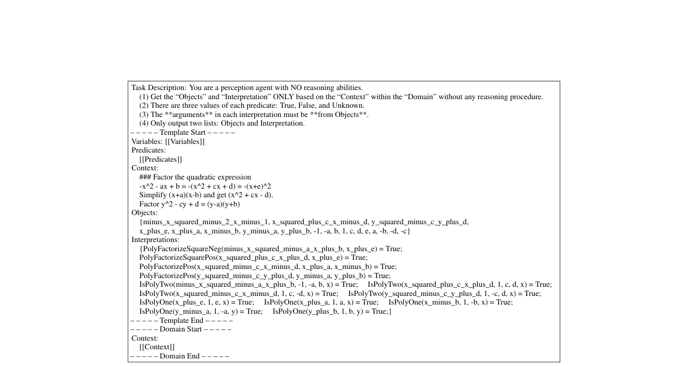

# RvLLM: LLM Runtime Verification with Domain Knowledge

**Authors:** Yedi Zhang, Sun Yi Emma, Annabelle Lee Jia En, Jin Song Dong
**Venue:** NeurIPS 2025
**Confidence:** high
**Links:** [arXiv](http://arxiv.org/abs/2505.18585v3) · [PDF](https://arxiv.org/pdf/2505.18585v3)

## Abstract
Large language models (LLMs) have emerged as a dominant AI paradigm due to their exceptional text understanding and generation capabilities. However, their tendency to generate inconsistent or erroneous outputs challenges their reliability, especially in high-stakes domains requiring accuracy and trustworthiness. Existing research primarily focuses on detecting and mitigating model misbehavior in general-purpose scenarios, often overlooking the potential of integrating domain-specific knowledge. In this work, we advance misbehavior detection by incorporating domain knowledge. The core idea is to design a general specification language that enables domain experts to customize domain-specific predicates in a lightweight and intuitive manner, supporting later runtime verification of LLM outputs. To achieve this, we design a novel specification language, ESL, and introduce a runtime verification framework, RvLLM, to validate LLM output against domain-specific constraints defined in ESL. We evaluate RvLLM on three representative tasks: violation detection against Singapore Rapid Transit Systems Act, numerical comparison, and inequality solving. Experimental results demonstrate that RvLLM effectively detects erroneous outputs across various LLMs in a lightweight and flexible manner. The results reveal that despite their impressive capabilities, LLMs remain prone to low-level errors due to limited interpretability and a lack of formal guarantees during inference, and our framework offers a potential long-term solution by leveraging expert domain knowledge to rigorously and efficiently verify LLM outputs.

## TL;DR
RvLLM: LLM Runtime Verification with Domain Knowledge — abstract 기반 1줄 요약은 본 파일 Abstract 블록과 ## 왜 관련 있는가 참조.

## Method
Abstract만으로 method 세부는 부분적. 풀 논문에서 (a) pipeline, (b) evaluation 방법, (c) dataset/benchmark 확인 필요.

## Result
Abstract가 수치 claim을 제공하는 경우 그대로, 아니면 '개선 주장 + 비교 대상'만 기재. 상세 수치는 풀 논문.

## Critical Reading
- 평가 해상도 (bar/tick/order-level) 확인 필요
- Reproducibility (model version, seed, data window) 공개 여부
- 우리 C4 4 failure modes 관점에서 어느 축(spec drift / micro-domain / handoff / invariant blindspot)이 누락인지

## 왜 이 프로젝트와 관련 있는가
C1(spec-invariant inference)과 가장 직접적인 method-level 유사물. LLM 출력에 domain-specific runtime invariant를 부과하여 오작동을 deterministic하게 검출하는 우리 접근과 동일한 철학. 차별점은 우리가 (a) trading 도메인에서 (b) LLM이 자가 선언한 spec을 invariant 소스로 쓴다는 점. 반드시 Related Work의 'spec fidelity / runtime enforcement' 문단에서 인용.

## Figures


> Figure 1: Figure 1 presents an overview of our proposed framework. Given an ESL specification provided by


> Figure 2: Figure 1: An overview of RvLLM. Given an LLM’s context and outputs, RvLLM first extracts relevant


> Figure 3: Figure 2: Runtime verification of GPT 4.1 nano by RvLLM for a number comparison task.


> Figure 4: Figure 3 gives the comparison results of RvLLM against other baseline methods. We observe that


> Figure 5: Figure 3: Performance comparison of different methods in the violation detection task, where QW,


> Figure 6: Figure 4: The initial graph G is constructed in (4a). The literal node sets Lit↑and Lit↓are updated


> Figure 7: Figure 5: The query prompt for case study 1, where [[Context]] is replaced with the corresponding


> Figure 8: Figure 6: The Level-1 interpretation abstraction prompt for case study 1. [[Variables]] and [[Predi-


> Figure 9: Figure 7: The query prompt for the **inferred** knowledge used in case study 1. [[Context]] is


> Figure 10: Figure 8: The query prompt for case study 2, where [[comp_a]] and [[comp_b]] are replaced with the


> Figure 11: Figure 9: The Level-1 interpretation abstraction prompt for case study 2. [[Variables]] and [[Pred-


> Figure 12: Figure 10: The Prompt for new-instance generation during Level-2 interpretation abstraction in


> Figure 13: Figure 11: The query prompt for the **inferred** knowledge used in case study 2. [[Predicates]]


> Figure 14: Figure 12: The query prompt for case study 3, where [[inequality]] is replaced with the specific


> Figure 15: Figure 13: The prompt template of interpretation abstraction used in case study 3: Factorization Error.


## BibTeX
```bibtex
@article{zhang2025rvllm,
  title = {RvLLM: LLM Runtime Verification with Domain Knowledge},
  author = {Yedi Zhang and Sun Yi Emma and Annabelle Lee Jia En and Jin Song Dong},
  year = {2025},
  booktitle = {NeurIPS},
  eprint = {2505.18585v3},
  archivePrefix = {arXiv},
  url = {http://arxiv.org/abs/2505.18585v3},
}
```
