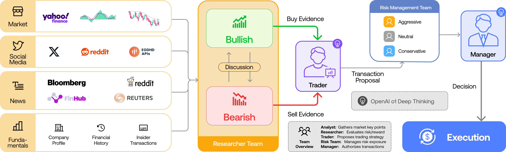
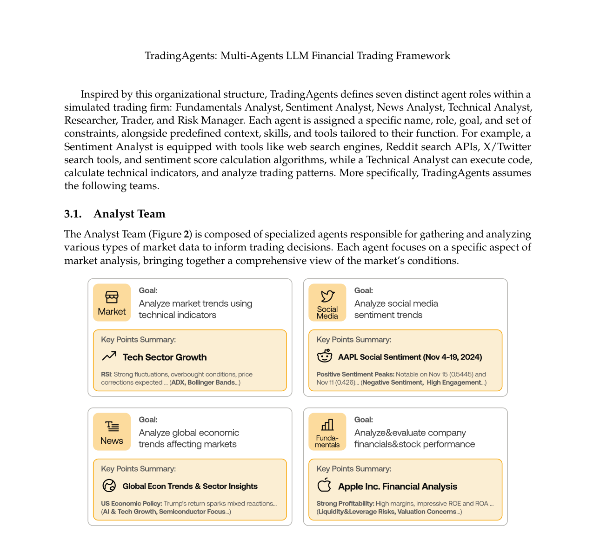
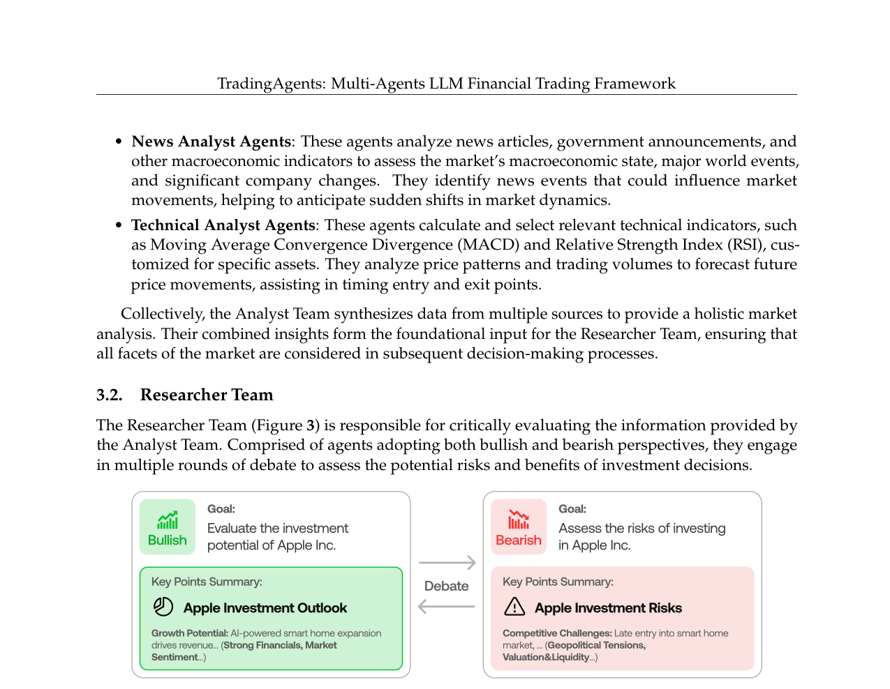
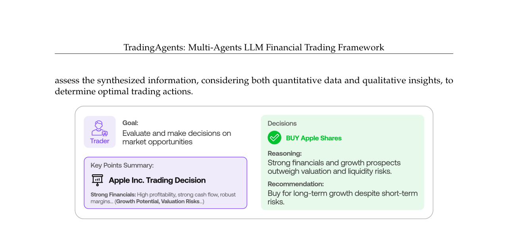
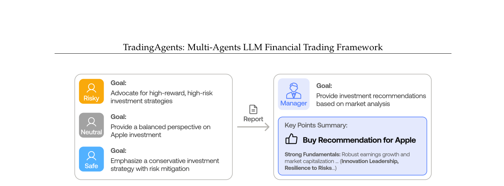
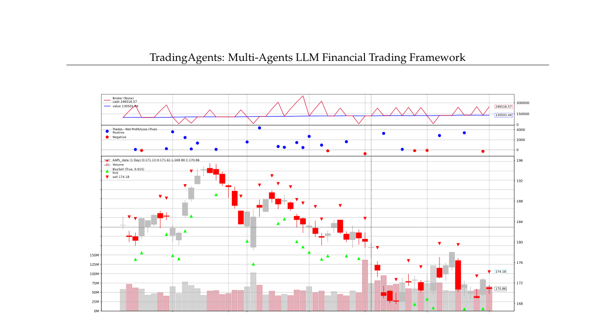
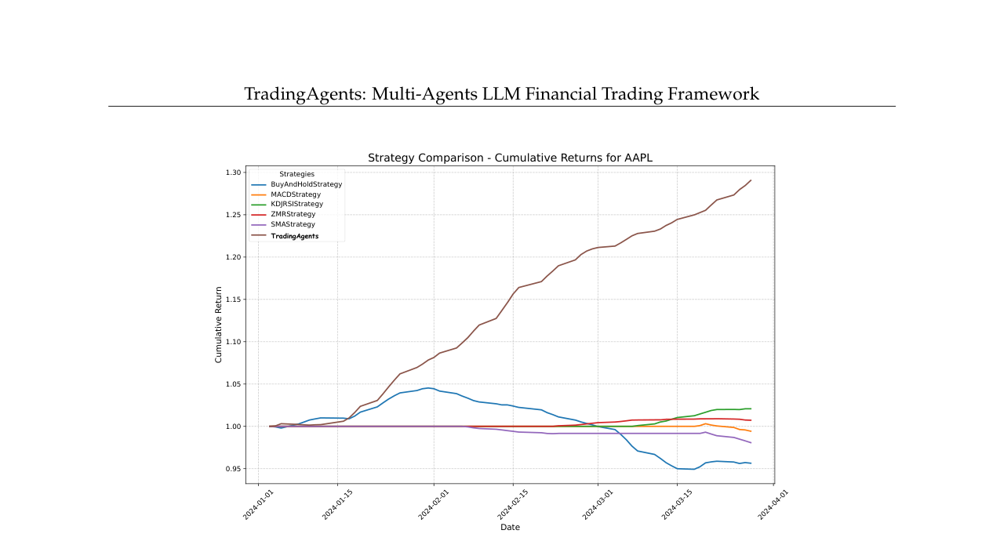

# Tradingagents: Multi-agents llm financial trading framework

**Authors:** Y Xiao, E Sun, D Luo, W Wang
**Venue:** arxiv_only 2024
**Confidence:** low
**Links:** [arXiv](https://arxiv.org/abs/2412.20138) · [PDF](https://arxiv.org/pdf/2412.20138?)

## Abstract
Recent advancements in multi-agent LLM frameworks for  the effectiveness of LLM-powered  alpha mining systems,  TradingAgents outperforms market benchmarks such as Buy-and-

## TL;DR
Tradingagents: Multi-agents llm financial trading framework — abstract 기반 1줄 요약은 본 파일 Abstract 블록과 ## 왜 관련 있는가 참조.

## Method
Abstract만으로 method 세부는 부분적. 풀 논문에서 (a) pipeline, (b) evaluation 방법, (c) dataset/benchmark 확인 필요.

## Result
Abstract가 수치 claim을 제공하는 경우 그대로, 아니면 '개선 주장 + 비교 대상'만 기재. 상세 수치는 풀 논문.

## Critical Reading
- 평가 해상도 (bar/tick/order-level) 확인 필요
- Reproducibility (model version, seed, data window) 공개 여부
- 우리 C4 4 failure modes 관점에서 어느 축(spec drift / micro-domain / handoff / invariant blindspot)이 누락인지

## 왜 이 프로젝트와 관련 있는가
paper_outline.md에서 이미 명시한 related multi-agent trading LLM 시스템. TradingAgents는 bar-level historical backtest + alpha mining이 중심 → tick-level fidelity gap이 여전히 unexplored. §2 Related Work의 첫 번째 baseline cluster.

## Figures


> Figure 1: Fig. 1: TradingAgents Overall Framework Organization. I. ANALYSTS TEAM: Four analysts concurrently


> Figure 2: Fig. 2: TradingAgents Analyst Team


> Figure 3: Fig. 3: TradingAgents Researcher Team: Bullish Perspectives and Bearish Perspectives


> Figure 4: Fig. 4: TradingAgents’s Trader Decision-Making Process


> Figure 5: Fig. 5: TradingAgents Risk Management Team and Fund Manager Approval Workflow


> Figure 6: Fig. 6: TradingAgents Detailed Transaction History for $AAPL. Green / Red Arrows indicate Long / Short


> Figure 7: Fig. 7: Cumulative Returns on $AAPL using TradingAgents. The figure shows the performance comparison of


## BibTeX
```bibtex
@article{xiao2024tradingagents,
  title = {Tradingagents: Multi-agents llm financial trading framework},
  author = {Y Xiao and E Sun and D Luo and W Wang},
  year = {2024},
  booktitle = {arXiv preprint arXiv:2412.20138},
  eprint = {2412.20138v7},
  archivePrefix = {arXiv},
  url = {https://arxiv.org/abs/2412.20138},
}
```
