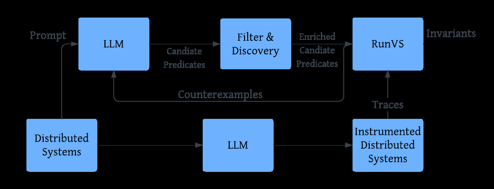
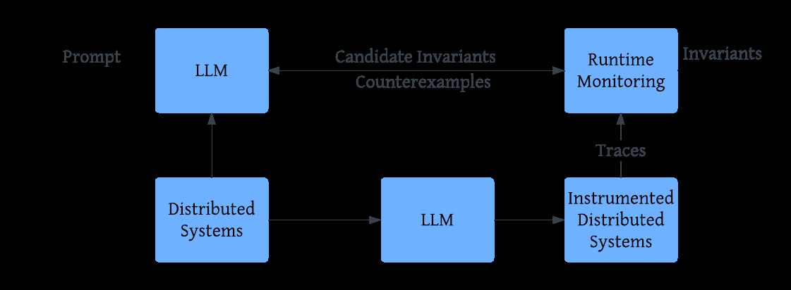

# Guiding Likely Invariant Synthesis on Distributed Systems with Large Language Models

**Authors:** Y Xia, AS Pingle, D Sur, S Ravi
**Venue:** arxiv_only 2025
**Confidence:** low
**Links:** [arXiv](https://ieeexplore.ieee.org/abstract/document/11378591/) · [PDF](https://repositum.tuwien.at/bitstream/20.500.12708/219559/1/Xia%20Yuan%20-%202025%20-%20Guiding%20Likely%20Invariant%20Synthesis%20on%20Distributed%20Systems%20with...pdf)

## Abstract
predefined specifications.  LLM-proposed predicates into a runtime verification loop in a  structured way. To our knowledge, this is the first work to combine LLM reasoning and invariant

## TL;DR
Guiding Likely Invariant Synthesis on Distributed Systems with Large Language Models — abstract 기반 1줄 요약은 본 파일 Abstract 블록과 ## 왜 관련 있는가 참조.

## Method
Abstract만으로 method 세부는 부분적. 풀 논문에서 (a) pipeline, (b) evaluation 방법, (c) dataset/benchmark 확인 필요.

## Result
Abstract가 수치 claim을 제공하는 경우 그대로, 아니면 '개선 주장 + 비교 대상'만 기재. 상세 수치는 풀 논문.

## Critical Reading
- 평가 해상도 (bar/tick/order-level) 확인 필요
- Reproducibility (model version, seed, data window) 공개 여부
- 우리 C4 4 failure modes 관점에서 어느 축(spec drift / micro-domain / handoff / invariant blindspot)이 누락인지

## 왜 이 프로젝트와 관련 있는가
C1(spec-invariant inference) 방법론에 가장 가까운 cross-domain 대응: LLM을 invariant 후보 생성에 쓰고 runtime verification loop에 통합. 우리는 역방향(spec → invariant 자동 유도 + static-by-construction)이라 정반대의 입장이지만 같은 문제 공간이라 반드시 positioning. 분산 시스템 domain.

## Figures


> Figure 1: Fig. 1: Predicate LLM Synthesis Framework


> Figure 2: Fig. 2: Invariant LLM Synthesis Framework


## BibTeX
```bibtex
@inproceedings{xia2025guiding,
  title = {Guiding Likely Invariant Synthesis on Distributed Systems with Large Language Models},
  author = {Y Xia and AS Pingle and D Sur and S Ravi},
  year = {2025},
  booktitle = {… Formal Methods in …},
  url = {https://ieeexplore.ieee.org/abstract/document/11378591/},
}
```
