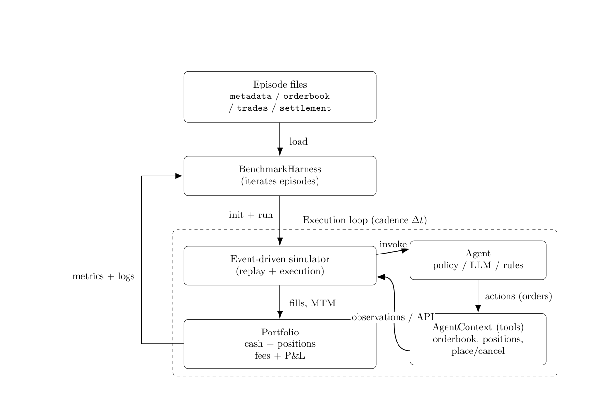

# PredictionMarketBench: A SWE-bench-Style Framework for Backtesting Trading Agents on Prediction Markets

**Authors:** A Arora, R Malpani
**Venue:** arxiv_only 2026
**Confidence:** low
**Links:** [arXiv](https://arxiv.org/abs/2602.00133) · [PDF](https://arxiv.org/pdf/2602.00133)

## Abstract
results for a RandomAgent, a tool-calling LLM agent (gpt-4.1-nano), and a classic Bollinger  Bands mean-reversion strategy,  High-fidelity market simulators such as ABIDES were

## TL;DR
PredictionMarketBench: A SWE-bench-Style Framework for Backtesting Trading Agents on Prediction Markets — abstract 기반 1줄 요약은 본 파일 Abstract 블록과 ## 왜 관련 있는가 참조.

## Method
Abstract만으로 method 세부는 부분적. 풀 논문에서 (a) pipeline, (b) evaluation 방법, (c) dataset/benchmark 확인 필요.

## Result
Abstract가 수치 claim을 제공하는 경우 그대로, 아니면 '개선 주장 + 비교 대상'만 기재. 상세 수치는 풀 논문.

## Critical Reading
- 평가 해상도 (bar/tick/order-level) 확인 필요
- Reproducibility (model version, seed, data window) 공개 여부
- 우리 C4 4 failure modes 관점에서 어느 축(spec drift / micro-domain / handoff / invariant blindspot)이 누락인지

## 왜 이 프로젝트와 관련 있는가
SWE-bench 스타일의 trading agent 평가 프레임워크 (2026). 우리 paper의 핵심 문제의식(LLM code gen 평가 → trading 적용)과 motivational framing이 직접 겹침. ABIDES를 'high-fidelity'로 언급하여 우리가 tick-level LOB를 더 낮은 해상도로 대비할 수 있는 대조군. prediction market이라는 도메인 차이는 있으나 frameworking argument에서 인용 필수.

## Figures


> Figure 1: Figure 1: PredictionMarketBench execution flow. The harness iterates over episodes, the simulator


## BibTeX
```bibtex
@inproceedings{arora2026predictionmarketbench,
  title = {PredictionMarketBench: A SWE-bench-Style Framework for Backtesting Trading Agents on Prediction Markets},
  author = {A Arora and R Malpani},
  year = {2026},
  booktitle = {arXiv preprint arXiv:2602.00133},
  url = {https://arxiv.org/abs/2602.00133},
}
```
