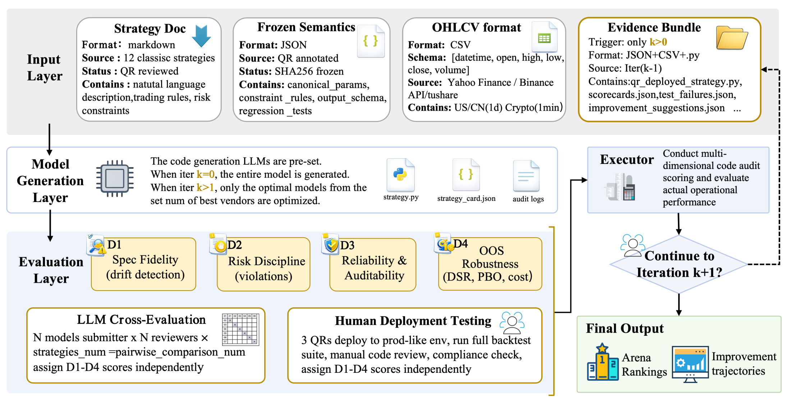
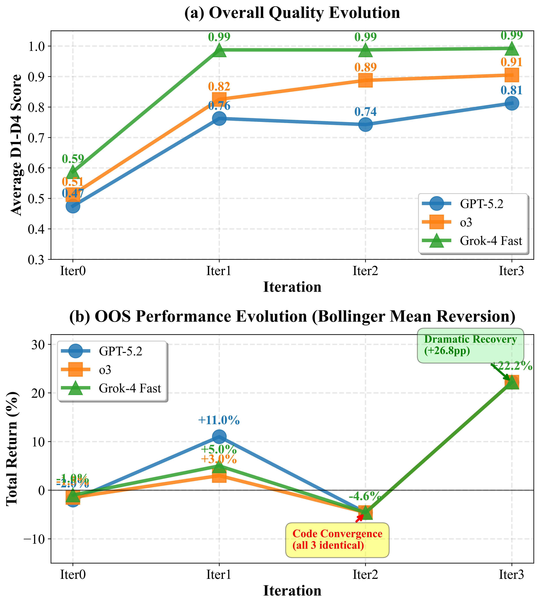
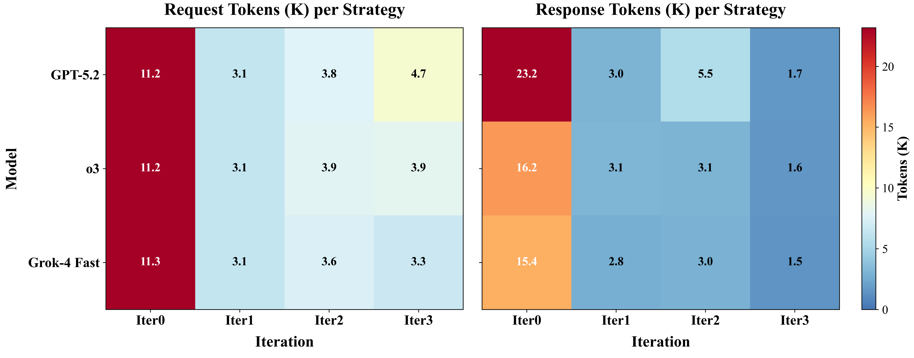
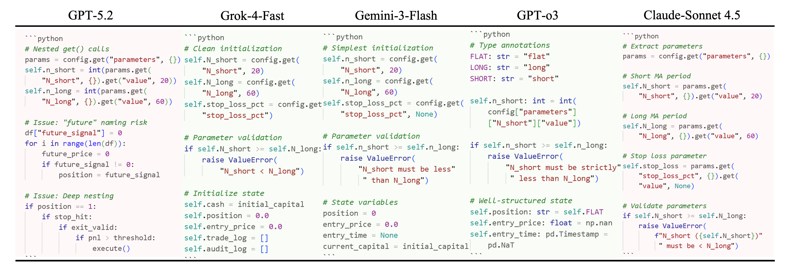
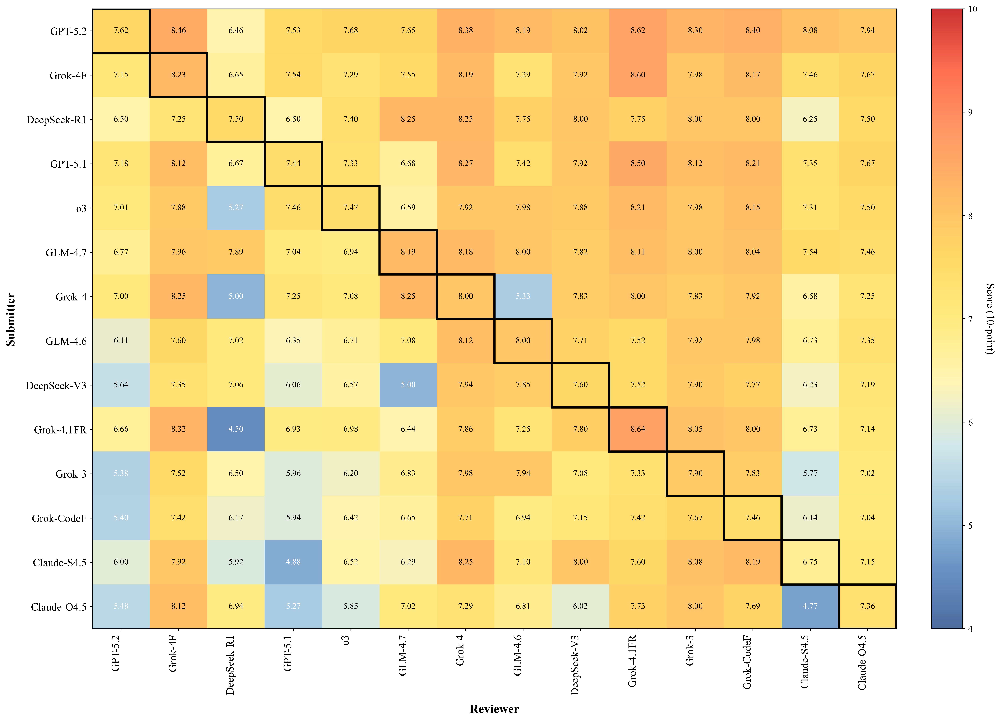

# SysTradeBench: An Iterative Build-Test-Patch Benchmark for Strategy-to-Code Trading Systems with Drift-Aware Diagnostics

**Authors:** Y Cao, H Zhang, JW Keung, Y Chen, L Song
**Venue:** arxiv_only 2026
**Confidence:** low
**Links:** [arXiv](https://arxiv.org/abs/2604.04812) · [PDF](https://arxiv.org/pdf/2604.04812)

## Abstract
strategy code that can be backtested and refined. However,  benchmark system-level  correctness and governability (fidelity,  Our evaluation reveals a nuanced picture of LLM

## TL;DR
SysTradeBench: An Iterative Build-Test-Patch Benchmark for Strategy-to-Code Trading Systems with Drift-Aware Diagnostics — abstract 기반 1줄 요약은 본 파일 Abstract 블록과 ## 왜 관련 있는가 참조.

## Method
Abstract만으로 method 세부는 부분적. 풀 논문에서 (a) pipeline, (b) evaluation 방법, (c) dataset/benchmark 확인 필요.

## Result
Abstract가 수치 claim을 제공하는 경우 그대로, 아니면 '개선 주장 + 비교 대상'만 기재. 상세 수치는 풀 논문.

## Critical Reading
- 평가 해상도 (bar/tick/order-level) 확인 필요
- Reproducibility (model version, seed, data window) 공개 여부
- 우리 C4 4 failure modes 관점에서 어느 축(spec drift / micro-domain / handoff / invariant blindspot)이 누락인지

## 왜 이 프로젝트와 관련 있는가
2026 SysTradeBench는 drift-aware diagnostics + iterative build-test-patch — 우리 'spec-implementation drift' C4-5.1과 주제·도구가 겹침. 가장 강력한 동시대 경쟁이 될 수 있는 논문. 차별점: 우리는 (a) spec-invariant inference가 LLM-declared spec에서 자동 유도됨, (b) dual-mode counterfactual로 drift의 PnL 기여를 정량화함, (c) tick-level LOB로 해상도를 낮춤. 세 축 모두 명시 대조 필요.

## Figures


> Figure 1: Figure 1: System Architecture and Iterative Workflow of SysTradeBench


> Figure 2: Figure 2: RQ3: Learning curves for Bollinger Mean Reversion


> Figure 3: Figure 3: RQ4: Token usage heatmap (3 models × 4 iterations).


> Figure 4: Figure 4: Illustrative Example: Code Quality Issues Across Five LLMs


> Figure 5: Figure 5: Iter0 cross-evaluation heatmap.


## BibTeX
```bibtex
@inproceedings{cao2026systradebench,
  title = {SysTradeBench: An Iterative Build-Test-Patch Benchmark for Strategy-to-Code Trading Systems with Drift-Aware Diagnostics},
  author = {Y Cao and H Zhang and JW Keung and Y Chen and L Song},
  year = {2026},
  booktitle = {arXiv preprint arXiv …},
  url = {https://arxiv.org/abs/2604.04812},
}
```
