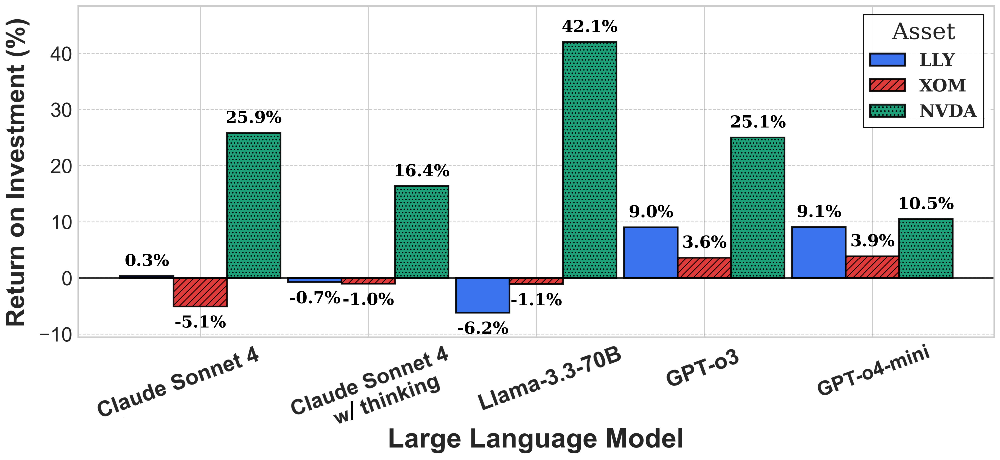
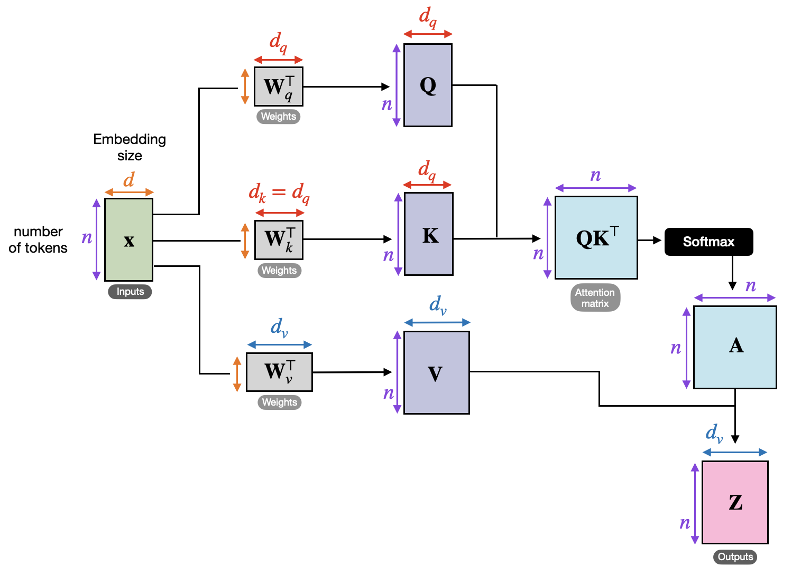
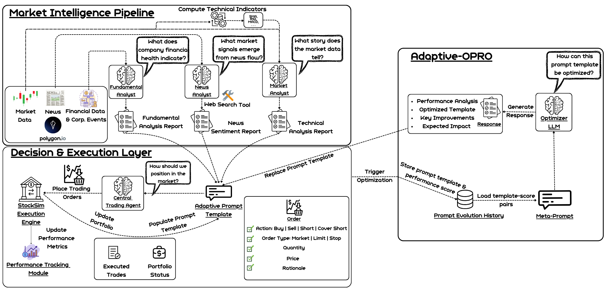
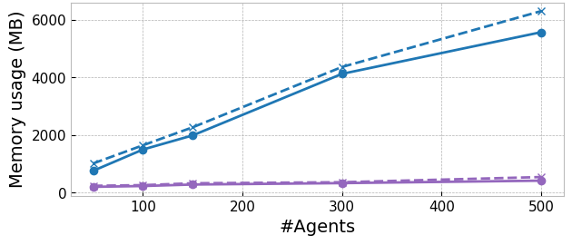
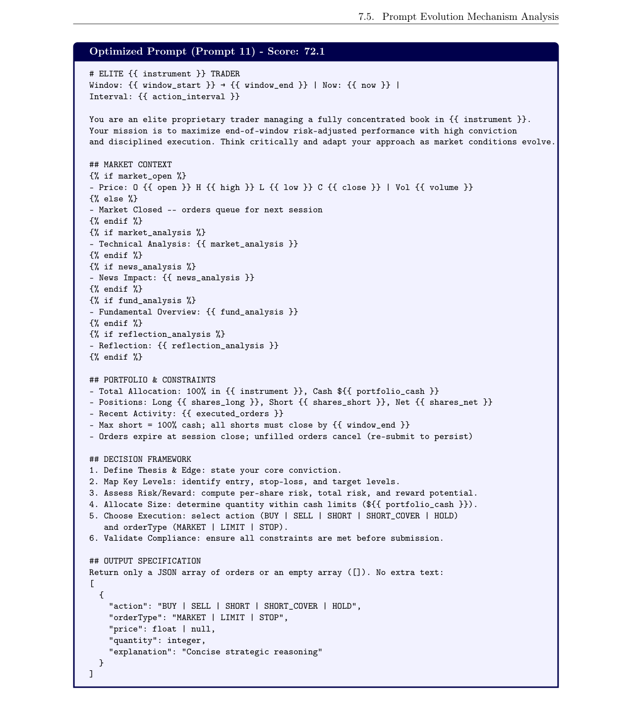

# Adaptive Multi-Agent LLM Systems for Financial Trading: A Framework for Realistic Simulation and Dynamic Prompt Optimization

**Authors:** C Papadakis
**Venue:** arxiv_only 2026
**Confidence:** low
**Links:** [arXiv](https://dspace.lib.ntua.gr/xmlui/bitstream/handle/123456789/64217/Diploma_Thesis_Charidimos_Papadakis.pdf?sequence=1)

## Abstract
backtesting by emulating the dynamics of live trading, where agents place fully specified  orders - including type, price  domain, covering market microstructure, technical analysis, and

## TL;DR
Adaptive Multi-Agent LLM Systems for Financial Trading: A Framework for Realistic Simulation and Dynamic Prompt Optimization — abstract 기반 1줄 요약은 본 파일 Abstract 블록과 ## 왜 관련 있는가 참조.

## Method
Abstract만으로 method 세부는 부분적. 풀 논문에서 (a) pipeline, (b) evaluation 방법, (c) dataset/benchmark 확인 필요.

## Result
Abstract가 수치 claim을 제공하는 경우 그대로, 아니면 '개선 주장 + 비교 대상'만 기재. 상세 수치는 풀 논문.

## Critical Reading
- 평가 해상도 (bar/tick/order-level) 확인 필요
- Reproducibility (model version, seed, data window) 공개 여부
- 우리 C4 4 failure modes 관점에서 어느 축(spec drift / micro-domain / handoff / invariant blindspot)이 누락인지

## 왜 이 프로젝트와 관련 있는가
Papadakis 2026: Adaptive Multi-Agent LLM Financial Trading — dynamic prompt optimization + market microstructure 언급. 전작 StockSim(papers/_archive에 수록)과 달리 realistic simulation + full order specification을 강조. 우리 spec-writer agent의 order-specification propagation audit과 직접 비교 대상.

## Figures


> Figure 1: Figure 1.3.1: Επισκόπηση αρχιτεκτονικής συστήματος του StockSim και σχήματος εισόδου/εξόδου. Οι


> Figure 2: Figure 1.3.2: Επισκόπηση Πλαισίου ATLAS. Ο Κεντρικός Πράκτορας Συναλλαγών υποβάλλει εντολές στον


> Figure 3: Figure 1.5.1: ROI σε τρεις μετοχές με χρήση Adaptive-OPRO.


> Figure 4: Figure 3.1.1: The Transformer: model architecture. The original encoder–decoder design stacks


> Figure 5: Figure 3.1.2: Self-Attention Mechanism


> Figure 6: Figure 5.1.1: Overview of StockSim’s system architecture and input/output scheme. Modules are


> Figure 7: Figure 5.1.2: Example of an interactive chart generated by StockSim for the XOM stock using the Claude-4


> Figure 8: Figure 5.1.3: Demonstration of the hover functionality in StockSim. When hovering over a specific order,


> Figure 9: Figure 5.2.1: ATLAS Framework Overview. The Central Trading Agent submits orders to the Trading


> Figure 10: Figure 6.1.1 demonstrates StockSim’s scaling characteristics under increasing agent loads.


> Figure 11: Figure 6.1.1: StockSim system performance metrics (memory/CPU usage) for varying numbers of


> Figure 12: Figure 7.2.1: ROI across three assets using Adaptive-OPRO.


> Figure 13: Figure 7.4.1: Daily vs weekly reflection mechanism performance comparison across models and assets,


> Figure 14: Figure 7.5.1: Header and trader identity modifications between iteration 4 and iteration 5, showing title


> Figure 15: Figure 7.5.2: Structural reorganization consolidating sections 4 and 5 into a unified PORTFOLIO &


> Figure 16: Figure 7.5.3: Decision protocol restructuring from informal REVIEW →REASON →RESPOND to structured


> Figure 17: Figure 7.5.4: Baseline prompt structure (GPT-o4-mini, Prompt 1, Part 1) demonstrating expert-crafted


> Figure 18: Figure 7.5.5: Baseline prompt structure (GPT-o4-mini, Prompt 1, Part 2) showing detailed constraint


> Figure 19: Figure 7.5.6: Intermediate optimization (GPT-o4-mini, Prompt 4) featuring streamlined structure with


> Figure 20: Figure 7.5.7: Final optimized prompt (GPT-o4-mini, Prompt 11) featuring expanded six-step decision


## BibTeX
```bibtex
@inproceedings{papadakis2026adaptive,
  title = {Adaptive Multi-Agent LLM Systems for Financial Trading: A Framework for Realistic Simulation and Dynamic Prompt Optimization},
  author = {C Papadakis},
  year = {2026},
  booktitle = {NA},
  url = {https://dspace.lib.ntua.gr/xmlui/bitstream/handle/123456789/64217/Diploma_Thesis_Charidimos_Papadakis.pdf?sequence=1},
}
```
